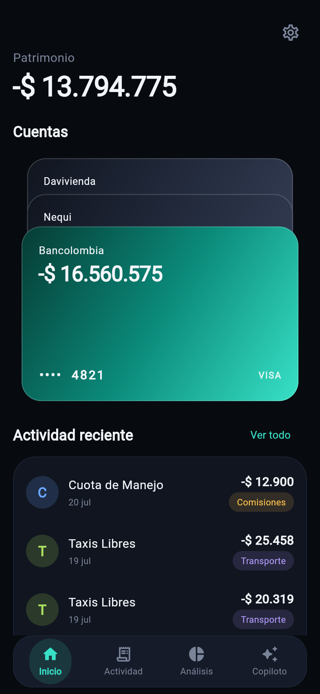
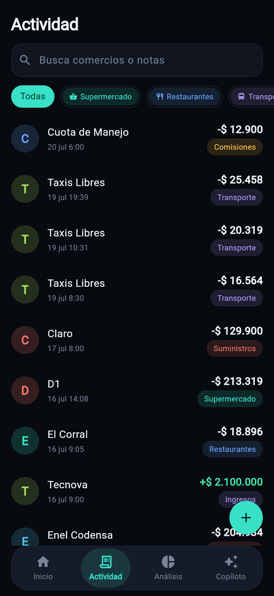
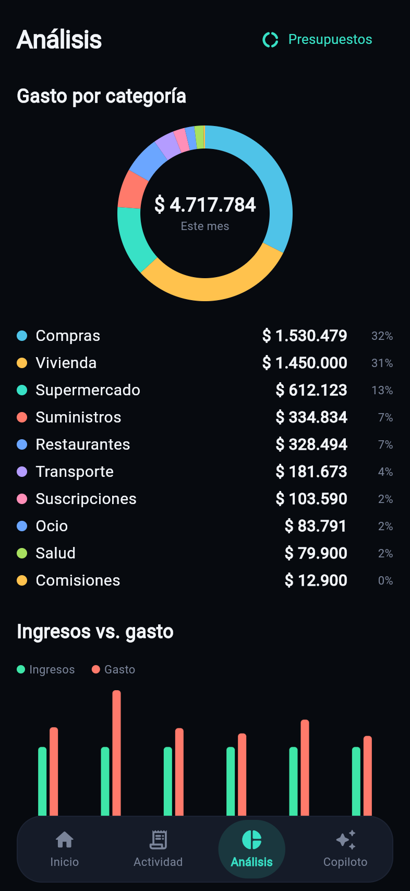
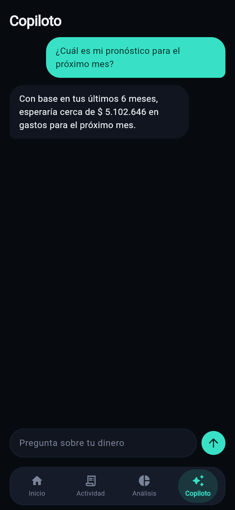
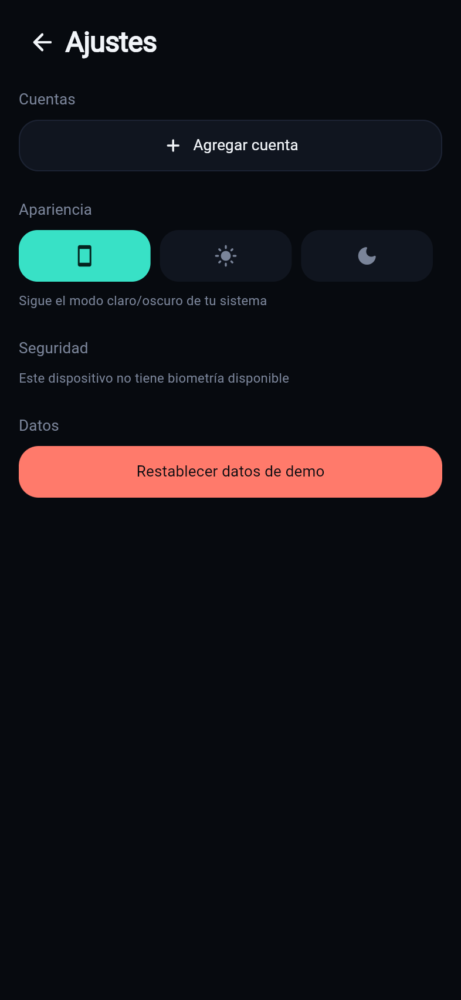
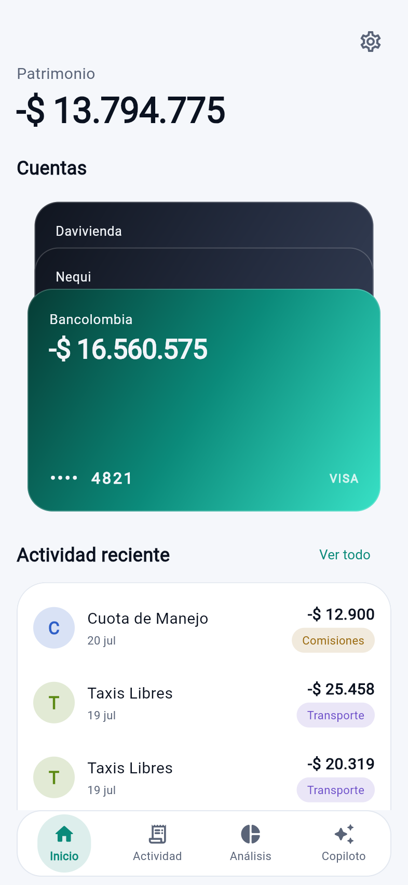
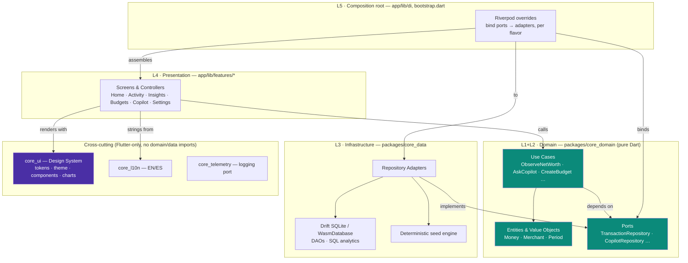
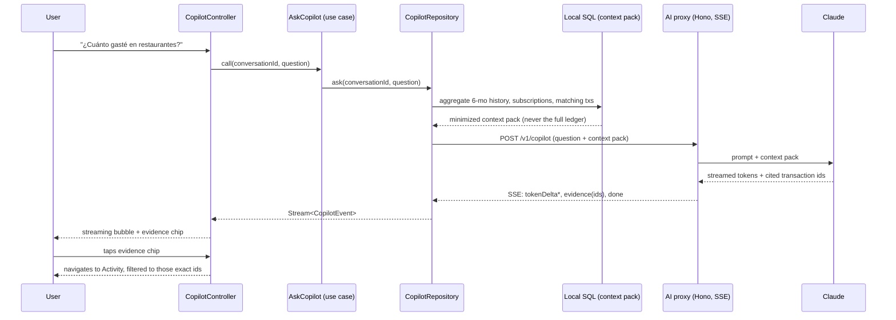

# LUMEN AI

> An AI-native personal finance app — a beautifully designed wallet that understands your spending and gives you a financial copilot you can talk to.

Built solo, end to end: product framing, a from-scratch design system,
domain modeling, a reactive local-first data layer, custom chart
painters, and a grounded conversational AI — across mobile (iOS/Android)
and a fully working web build, all sharing one codebase.

**[Try the live demo →](https://adriantx23.github.io/lumenai/)** · [Design-system catalog (Widgetbook) →](https://adriantx23.github.io/lumenai/widgetbook/) · Or run it yourself in under a minute, see [Getting started](#getting-started).

## Screenshots

| | |
|---|---|
|  |  |
|  |  |
|  |  |

All seven screens come from the real, running app on a fresh seeded
dataset — not mockups.

## What this is

LUMEN AI is the intelligence layer on top of your financial life: it
unifies accounts and cards, understands spending patterns with
deterministic local algorithms, and answers questions about your money
through a conversational copilot that only ever cites real transactions
— never a hallucinated figure. It does **not** try to be a bank: no real
banking connections, no payments, no KYC. That's deliberate — it keeps
the project credible as a portfolio piece, and lets the engineering and
design quality carry the story. See
[docs/01-product-vision.md](docs/01-product-vision.md) for the full
positioning.

The app ships with a realistic seeded demo dataset (Colombian market:
COP, local merchants, salary/rent cycles, a couple of planted anomalies
for the copilot to find) so it's immediately explorable — and, per the
Phase "manual entry" milestone, you can add your own real accounts and
transactions on top of it. On the web build, everything you enter stays
entirely in **your own browser's local storage** — nothing is sent
anywhere, because there is no backend for this in v1, by design.

## Architecture

Feature-first Clean Architecture over a modular monorepo, with Ports &
Adapters at the edges and a stream-first, unidirectional data flow. Full
rationale in [docs/02-architecture.md](docs/02-architecture.md) and
[ADRs 001–007](docs/adr/); the short version:



`core_domain` depends on nothing; `core_ui` depends on nothing but
Flutter. Every arrow points inward — enforced at compile time by
package boundaries and checked in CI by `tools/check_boundaries.sh`. An
illegal import is a build failure, not a review comment.

### The copilot's grounded-answer path



The dev/demo build (including this web build) swaps `Proxy`/`Model` for
`MockCopilotRepository` — a keyword router over the same local use cases
— so the model, real or mocked, never invents a number: every figure the
copilot says is queried from the same deterministic pipeline the rest of
the app uses.

## Deep dives

Three decisions worth reading if you want to see the reasoning, not just
the result:

1. [Why `Money` is 25 lines and has no `double` in it](docs/case-study/01-money-value-object.md)
2. [A copilot that has to show its work](docs/case-study/02-grounded-ai-copilot.md)
3. [Testing a design system with screenshots, on purpose](docs/case-study/03-golden-test-strategy.md)

## Tech stack

Flutter 3.x / Dart 3 · Melos monorepo · Riverpod 2 (state + DI) ·
go_router (typed) · freezed sealed unions · Drift (SQLite native,
WasmDatabase on web) · custom-painter charts · Widgetbook + alchemist
goldens · TypeScript (Hono) AI proxy · GitHub Actions CI.

## Workspace

```
app/         Composition root + feature presentation slices (iOS · Android · Web)
packages/    core_domain · core_data · core_ui · core_l10n · core_telemetry
widgetbook/  Living design-system gallery
docs/        Planning suite, ADRs, and this case study
```

## Getting started

```sh
dart pub get              # resolves the workspace (melos is a root dev dependency)
dart run melos bootstrap
dart run melos run analyze
dart run melos run test

# Run on a simulator/device
flutter run --flavor dev -t app/lib/main_dev.dart

# Run in a browser
flutter build web -t app/lib/main_web.dart --output app/build/web
python3 -m http.server 4173 --directory app/build/web
```

## Status

Phases 0–7 complete: design system, domain + data layer, wallet &
activity, insights & budgets, the Lumen Copilot, onboarding/security/
polish, manual account & transaction entry, and this web build. See
[docs/07-roadmap.md](docs/07-roadmap.md) for the full phased history and
exit criteria per phase.

## License

[MIT](LICENSE)
